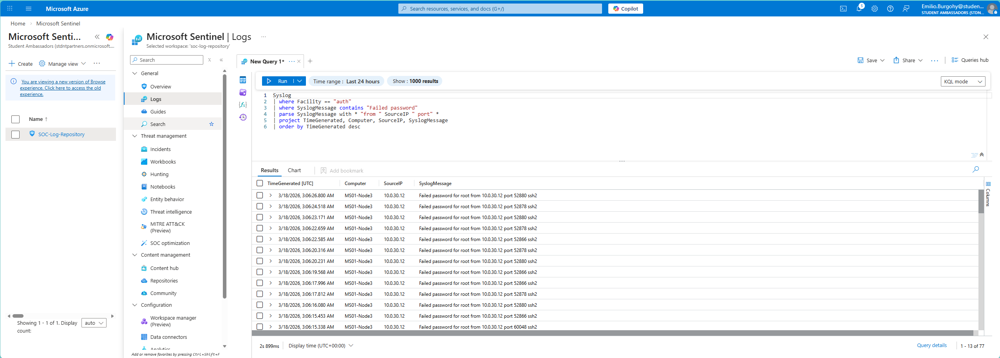
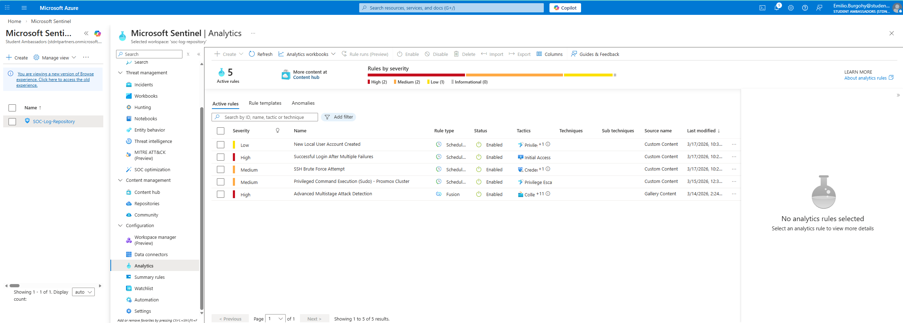
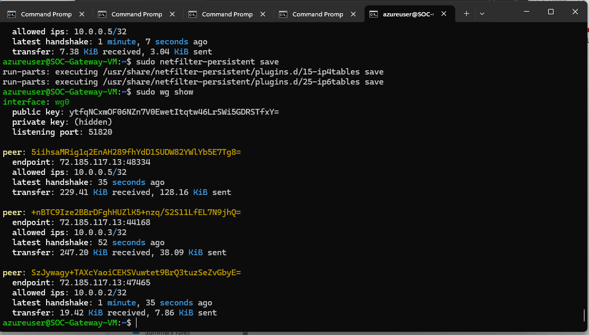
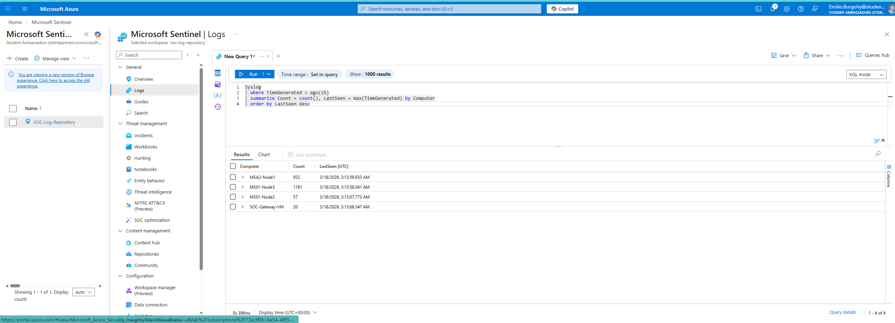
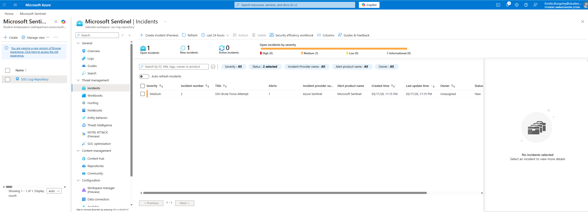
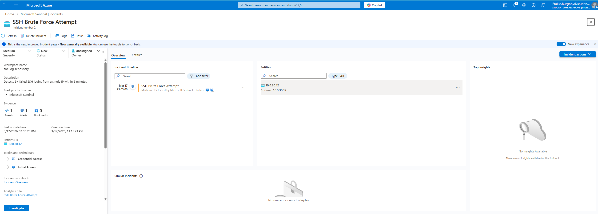
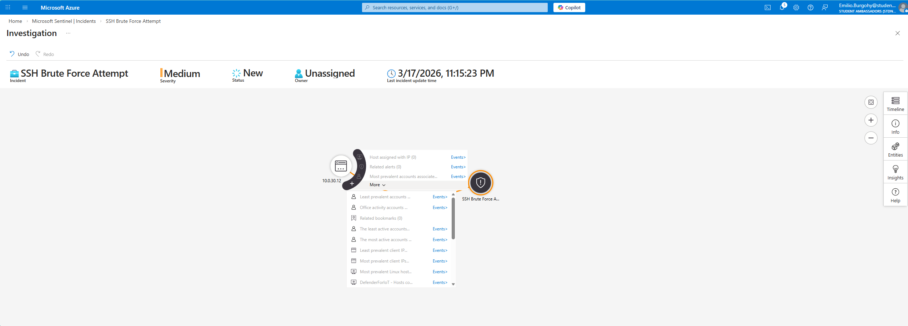
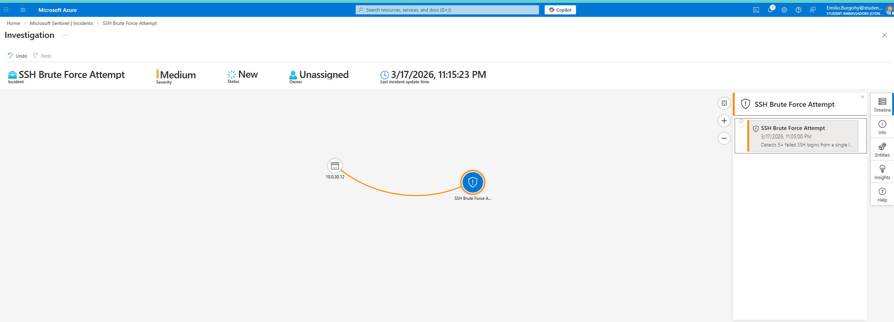
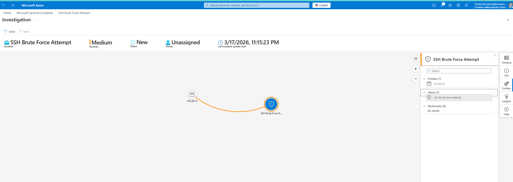

# 🛡️ Hybrid SOC Home Lab — Detection Engineering & Incident Response

**Built by Emilio Burgohy | Cybersecurity Analyst | USF MS Cybercrime & Digital Forensics**

[](https://www.comptia.org/)
[](https://www.isc2.org/)
[](https://www.comptia.org/)
[](https://azure.microsoft.com/en-us/products/microsoft-sentinel)
[](https://wazuh.com/)

---

## 🎯 Mission

This lab simulates a **real-world Hybrid SOC** by connecting on-premise infrastructure to cloud-native security tooling. The goal is to practice the full security operations lifecycle:

- **Detection Engineering** — Writing KQL rules that catch real attacker behavior
- **Incident Response** — Triaging, investigating, and documenting security events
- **Threat Simulation** — Attacking my own environment to validate detections
- **Cloud + On-Prem Integration** — Bridging local hardware to Microsoft Sentinel via secure tunnel

> This is not a theoretical lab. Every detection rule here was written in response to something observed in this environment.

---

## 🏗️ Infrastructure Overview

```
┌─────────────────────────────────────────────────────────────────┐
│                        HOME NETWORK                             │
│                     (Unifi Ecosystem)                           │
│   UDM Pro Max → USW Pro 48 PoE → 8-Port Agg → 24-Port Switch  │
└────────────────────────┬────────────────────────────────────────┘
                         │
        ┌────────────────┼────────────────┐
        │                │                │
   ┌────▼─────┐    ┌─────▼────┐    ┌─────▼────┐
   │  NODE 1  │    │  NODE 2  │    │  NODE 3  │
   │ MSA2 Mini│    │  MS01    │    │  MS01    │
   │ 128GB RAM│    │ 96GB RAM │    │ 96GB RAM │
   │  4TB NVMe│    │  2TB NVMe│    │  2TB NVMe│
   │          │    │          │    │          │
   │ [Wazuh]  │    │[OpenVAS] │    │  [DC01]  │
   │   SIEM   │    │  Vuln    │    │ Domain   │
   │          │    │  Scanner │    │Controller│
   │          │    │          │    │[Win11 VM]│
   │          │    │          │    │ Victim   │
   └──────────┘    └──────────┘    └──────────┘
        │                │                │
        └────────────────┼────────────────┘
                         │ Proxmox Cluster (All 3 Nodes)
                         │ 320GB RAM Total
                         │
                    ┌────▼────┐
                    │WireGuard│  ← Encrypted tunnel
                    │ Tunnel  │     (no open ports)
                    └────┬────┘
                         │
               ┌─────────▼──────────┐
               │    AZURE CLOUD      │
               │                    │
               │  [SOC-Gateway-VM]  │
               │   Ubuntu 24.04     │
               │   AMA + rsyslog    │
               │        ↓           │
               │ [Microsoft Sentinel]│
               │   5 Analytics Rules│
               │   Incident Mgmt    │
               └────────────────────┘
                         │
               ┌─────────▼──────────┐
               │  Security Onion    │  ← Bare metal (GMKtec 32GB)
               │  Network IDS/NSM   │
               └────────────────────┘
```

---

## 🖥️ Hardware Inventory

| Device | Role | RAM | Storage | Status |
|--------|------|-----|---------|--------|
| Minisforum MSA2 (Node 1) | Proxmox / Wazuh SIEM | 128GB | 4TB NVMe | 🟢 Online |
| Minisforum MS01 (Node 2) | Proxmox / OpenVAS | 96GB | 2TB NVMe | 🟢 Online |
| Minisforum MS01 (Node 3) | Proxmox / DC01 + Victim VM | 96GB | 2TB NVMe | 🟢 Online |
| GMKtec Mini PC | Security Onion (bare metal) | 32GB | 1TB HDD | 🟢 Online |
| Zimaboard 832 | Kali Linux Attack Platform | - | - | 🟢 Online |

**Network:** Unifi UDM Pro Max | USW Pro 48 PoE | 8-Port Aggregation | 24-Port Switch

---

## 🔐 WireGuard VPN Tunnel

Encrypted tunnel connecting all Proxmox nodes to Azure gateway for secure log forwarding — zero open inbound ports.

| Node | WireGuard IP | Status |
|------|-------------|--------|
| SOC-Gateway-VM (Azure) | 10.0.0.1 | 🟢 Online |
| MS01-Node2 | 10.0.0.2 | 🟢 Online |
| MS01-Node3 | 10.0.0.3 | 🟢 Online |
| MSA2-Node1 | 10.0.0.5 | 🟢 Online |

---

## 🔧 Security Stack

| Tool | Category | Purpose |
|------|----------|---------|
| Microsoft Sentinel | Cloud SIEM | Central log analysis, KQL detections, incident management |
| Wazuh | On-Prem SIEM/XDR | Host-based IDS, FIM, MITRE ATT&CK mapping |
| Security Onion | NSM / IDS | Network traffic analysis, Zeek logs, Suricata alerts |
| OpenVAS | Vulnerability Scanner | Continuous vulnerability assessment of lab assets |
| WireGuard | Secure Tunnel | Encrypted on-prem to Azure log forwarding |
| Azure Monitor Agent | Log Forwarding | Syslog → Sentinel pipeline via SOC-Gateway VM |
| Proxmox VE | Hypervisor | 3-node cluster managing all VMs |
| Unifi | Network Infrastructure | VLAN segmentation, firewall rules, traffic mirroring |
| Kali Linux | Threat Simulation | Authorized attack simulation to validate detections |

---

## 📊 Microsoft Sentinel Analytics Rules

5 active detection rules running 24/7:

| Rule | Severity | Type | Tactic |
|------|----------|------|--------|
| SSH Brute Force Attempt | Medium | Scheduled (Custom) | Credential Access, Initial Access |
| Successful Login After Multiple Failures | High | Scheduled (Custom) | Initial Access |
| New Local User Account Created | Low | Scheduled (Custom) | Persistence, Privilege Escalation |
| Privileged Command Execution (Sudo) - Proxmox | Medium | Scheduled (Custom) | Privilege Escalation |
| Advanced Multistage Attack Detection | High | Fusion (Built-in) | Multiple |

---

## ⚔️ Threat Simulations

### ✅ SSH Brute Force Attack (Completed — March 2026)

**Attacker:** Kali Linux (10.0.30.12)
**Target:** MS01-Node3 (10.0.30.13)
**Tool:** Hydra
**Result:** Sentinel detected attack and auto-generated Medium severity incident

**Attack command:**
```bash
hydra -l root -P /usr/share/wordlists/rockyou.txt -t 10 -s 22 10.0.30.13 ssh
```

**Detection chain:**
```
Kali launches attack
    → Failed logins logged by Node3 auth facility
    → rsyslog forwards via WireGuard tunnel to SOC-Gateway
    → Azure Monitor Agent ingests into Sentinel
    → KQL rule fires (5+ failures in 5 min threshold)
    → Incident auto-generated: "SSH Brute Force Attempt" (Medium)
    → Investigation graph maps attacker IP → target host
```

**Evidence:**

**01 — Live Syslog: Failed SSH attempts flooding in from Kali**


**02 — All 5 Analytics Rules Active in Sentinel**


**03 — WireGuard Tunnel: All 4 Nodes Connected**


**04 — All Nodes Reporting Logs to Sentinel**


**05 — Incident Auto-Generated: SSH Brute Force Attempt (Medium)**


**06 — Incident Details Panel**


**07 — Attack Investigation Graph: Kali IP → Target Host**


**08 — Incident Timeline**


**09 — Entities Extracted from Incident**


---

## 📁 Repository Structure

```
/hybrid-soc-homelab
│
├── README.md                    ← You are here
│
├── /screenshots                 ← Evidence from detections and simulations
│
├── /infrastructure              ← Lab setup guides & configs (sanitized)
│   ├── proxmox-cluster-setup.md
│   ├── wireguard-tunnel-setup.md
│   ├── azure-sentinel-onboarding.md
│   └── network-segmentation.md
│
├── /detections                  ← KQL & Wazuh detection rules
│   ├── README.md
│   ├── kql/
│   │   ├── ssh-brute-force.kql
│   │   ├── successful-login-after-failures.kql
│   │   ├── new-user-created.kql
│   │   └── sudo-abuse-detection.kql
│   └── wazuh/
│       └── custom-rules.xml
│
├── /runbooks                    ← Incident response playbooks
│   ├── README.md
│   ├── brute-force-response.md
│   ├── malware-triage.md
│   └── unauthorized-access.md
│
├── /findings                    ← Real detections from this lab
│   ├── README.md
│   └── (sanitized screenshots and write-ups)
│
└── /scripts                     ← Automation and utility scripts
    ├── README.md
    └── log-health-check.sh
```

---

## 🚀 Key Achievements

- ✅ Built 3-node Proxmox cluster (320GB RAM) running enterprise security tooling
- ✅ Established encrypted WireGuard tunnel — zero open inbound ports to internet
- ✅ All 4 nodes reporting logs to Microsoft Sentinel in real time
- ✅ Fixed AppArmor blocking rsyslog — persistent systemd service solution
- ✅ Made sysctl + iptables settings persistent across reboots
- ✅ Deployed 5 custom KQL analytics rules with auto-incident generation
- ✅ Ran first threat simulation — SSH brute force detected, incident auto-created in Sentinel
- ✅ Investigated incident using Sentinel investigation graph, timeline, and entities
- ✅ Deployed Wazuh SIEM with MITRE ATT&CK framework mapping
- ✅ Active Directory lab (DC01 + Windows 11 victim) for realistic attack simulation
- 🔄 Security Onion integration with Sentinel (planned)
- 🔄 OpenVAS vulnerability scan findings documentation (planned)
- 🔄 Additional threat simulations: lateral movement, privilege escalation (planned)
- 🔄 Automated incident response playbooks (planned)

---

## 🎓 Certifications & Education

| Credential | Status |
|-----------|--------|
| CompTIA Security+ | ✅ Certified |
| ISC2 CC | ✅ Certified |
| CompTIA CySA+ | 🎯 March 2026 |
| BS Cybersecurity (SPC) | ✅ December 2025 |
| MS Cybercrime & Digital Forensics (USF) | 🎓 In Progress — GPA 3.7 |
| US Army (9 years, 25L Signal/Communications) | ✅ Veteran |

---

## 📬 Connect

- **LinkedIn:** [linkedin.com/in/emilioburgohy198](https://linkedin.com/in/emilioburgohy198)
- **Email:** emilioburgohy@gmail.com
- **GitHub:** [github.com/ebuggy84](https://github.com/ebuggy84)

> *Building real SOC skills — one detection at a time.*
